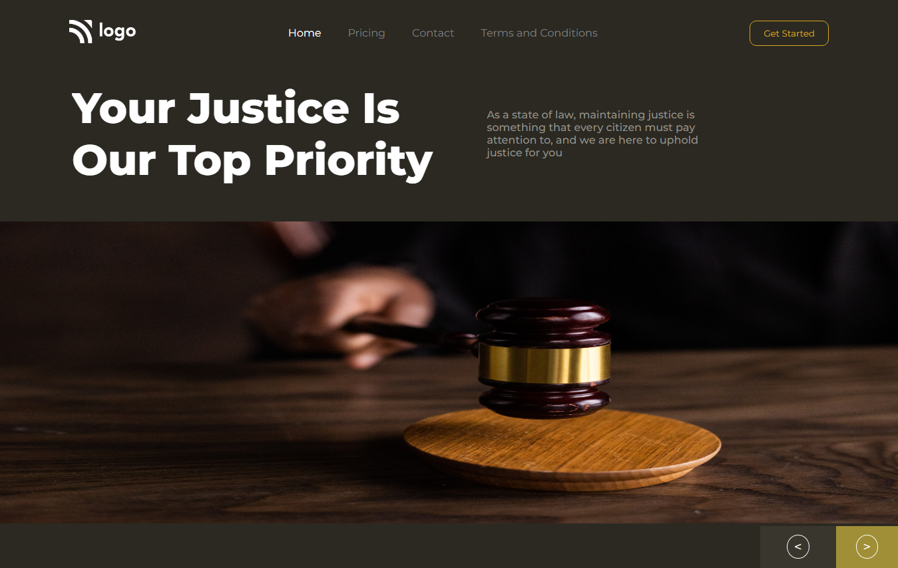

# Created By Punit Maheshwari

# Topic I learned

> In this project i learned about how to use Flexbox properties and set images in the backgroud.

# Time Taken

> This webpage takes around 1 hr.

# Screenshot

